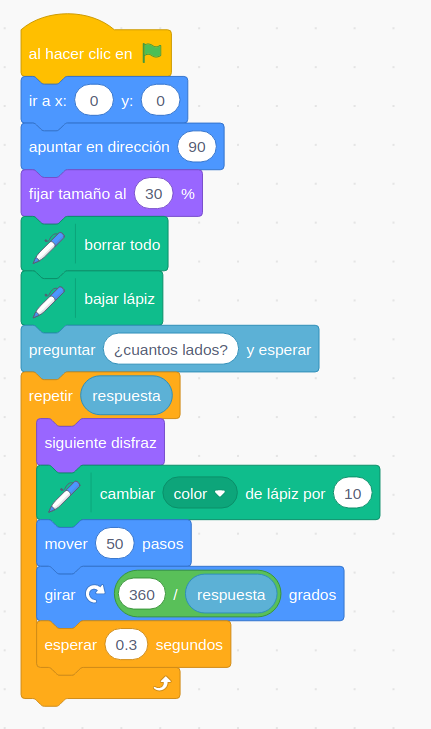
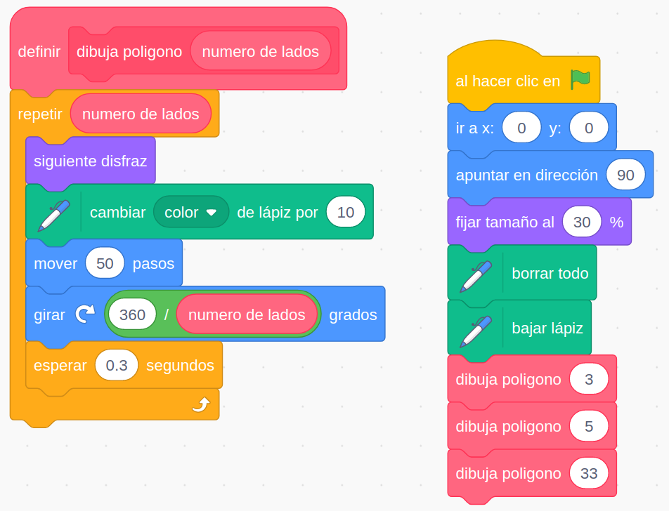
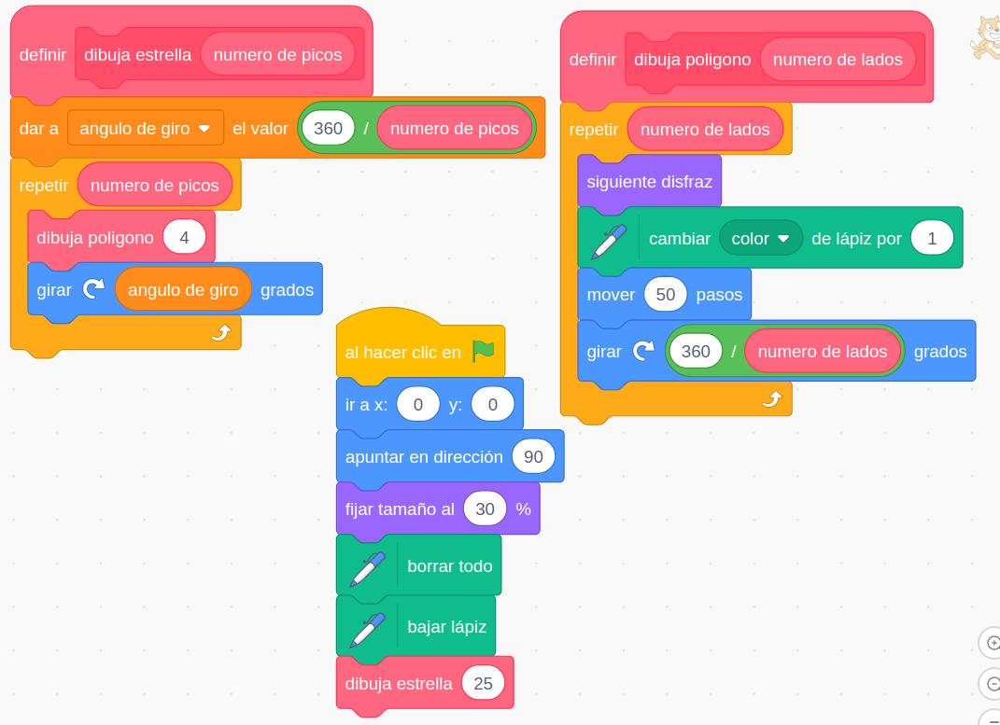
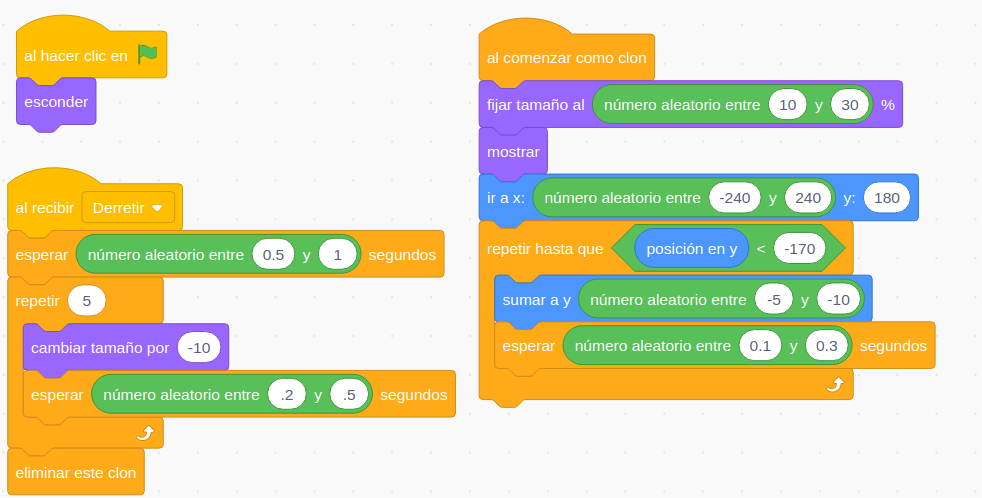
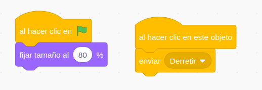
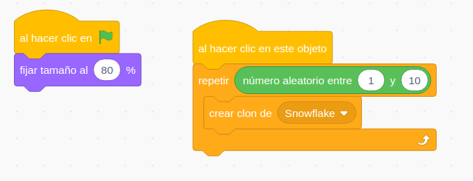

# Scratch y Arduino

## CEP Motril

### José Antonio Vacas @javacasm

## https://github.com/javacasm/ScratchArduinoMotril

* * * 

# Ejemplos

## Dibuja Polígono

[Proyecto](https://scratch.mit.edu/projects/339942571/)

## Dibuja Polígono 2 

Creamos un bloque/función

[Proyecto](https://scratch.mit.edu/projects/341771734/)

## Dibuja Estrellas 

A partir del bloque que dibujaba polígonos

[Proyecto](https://scratch.mit.edu/projects/341776098/)

## Nevada

Utilizamos clones y mensajes

Los copos

El Sol derrite los copos

El muñeco de nieve crea los copos

[Proyecto](https://scratch.mit.edu/projects/341785813/)

## Otros ejemplos

Veamos algunos ejemplos de juegos y cómo implementarlos en scratch

## El muro (arkanoid)

* Cada ladrillo es un clon. Los colocamos haciendo dos bucles anidados: en y (podemos aprovechar para cambiar el color/disfraz) y dentro uno en x (las variables x e y deben ser globales)
* Podemos hacer que el ángulo en el que sale la bola sea diferente según la parte de la raqueta con la que choque (así es en el original) para poder darle efectos a la bola.

Vemos como la detección es a nivel de objeto, no de clon

## Conducir coche 2D (psicotecnico)

Usamos el color de la carretera/del exterior para ver si conducimos por dentro o no

## Marcianitos (que bajan o suben)

* Nave
* Disparo (aparece a partir de la pulsación del disparo, toma la x de la nave en su inicio)
* Marciano (los clonamos como los ladrillos del arkanoid)

## Pong

* Pelota (que rebota en los bordes)
* Raquetas (2 jugadores o el ordenador usa una)
