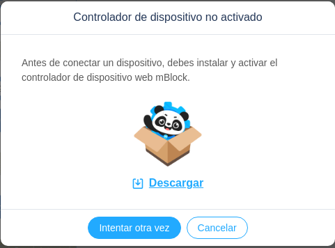
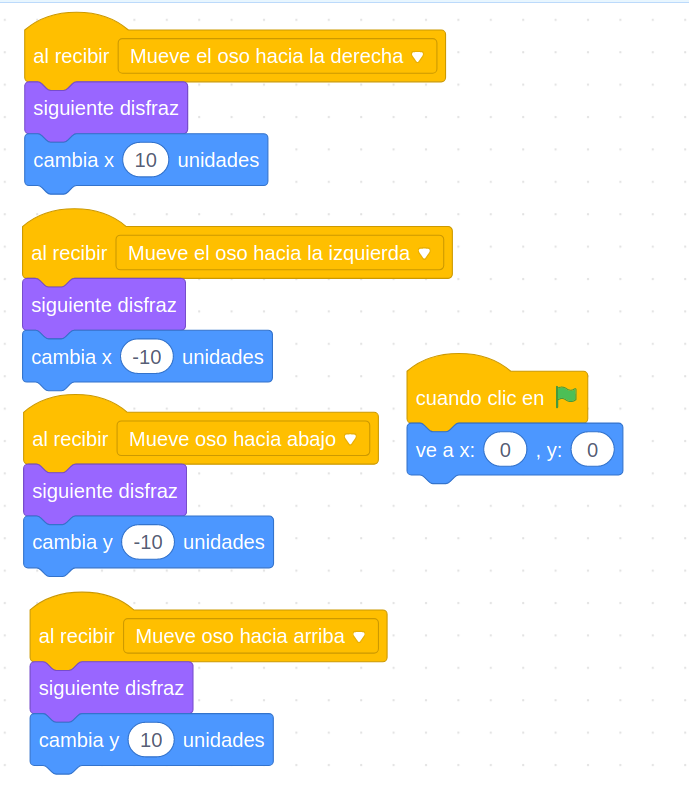

# Scratch y Arduino

## CEP Motril

### José Antonio Vacas @javacasm

## https://github.com/javacasm/ScratchArduinoMotril

## Entornos de programación

Se puede programar con cualquier entorno donde se programe Arduino (IDE, Arduinoblocks, biblock, mBlock, etc.)

## Programación

### Usaremos el IDE de mBlock https://ide.mblock.cc 

Soporta Bluetooth Controller, Codey Rocky, HaloCode, mBot, MotionBlock, Neuron, mBot Ranger, Ultimate 2.0, Arduino Uno, Arduino Mega2560, Nova Pi, MegaPi Pro

### Necesitamos el mblock mlink  https://www.mblock.cc/en-us/download/

[Guía de instalación](https://www.mblock.cc/doc/en/basics/mlink-quick-start-guide.html#mlink-quick-start-guide)

### Ejecutamos mLink

En windows
 

En osX

En linux

    sudo mblock-mlink start 
  

### Seleccionamos el dispositivo

Y pulsamos conectar

## Ejemplos

### Hello LED!!

Haremos parpadear el led Rojo

Ahora vamos a usar un led conectado al pin 11

[Proyecto](https://planet.mblock.cc/project/102035)

### Graduando el brillo del led

Vamos hora a graduar el nivel de brillo

[Proyecto](https://planet.mblock.cc/project/109965)

### Led RGB

¿Y si mezclamos colores?

[Selector de colores](https://htmlcolorcodes.com/es/)

Utilizamos el led RGB (conectado a lo pines digitales 9,5,6)

Y a la vez haremos que se vayan leyendo los colores en inglés, con la extensión Text To Speech.

Parece que hay algo de desajuste. Tendremos que mejorar la comunicación con ... mensajes    

[Programa](https://planet.mblock.cc/project/projectshare/101707)

### Sistema de riego

Vamos a medir la humedad del suelo para crear un sistema automático de riego
* Conectamos un sensor de humedad de suelo a la entrada IN de echidna (A4)
* Conectamos un servomotor para simular a la válvula/grifo que enciende el riego. Alternativamente podemos usarlo para mover un cartel/indicador que nos diga que la planta tiene sed

En función del nivel de humedad enviamos 3 mensajes distintos: Húmedo, Seco y Muy Seco

Se han creado varios fondos y varios personajes que cambian al recibir los mensajes

[Proyecto](https://planet.mblock.cc/project/103662)

### Nivel de luz

Vamos a leer el valor de un sensor de luz

Usaremos los 3 leds de colores para indicar el nivel de luz:
* Rojo: luz baja
* Amarillo: nivel de luz medio
* Verde: luz suficiente

[Proyecto](https://planet.mblock.cc/project/102785)

### Controlando el movimiento de Osito con el Joystick

Conectamos el joystick a los pines analógicos A0 (eje x) y A1 (eje y). Vamos a ver los valores que encontramos.

Vemos como la lectura de los sensores analógicos fluctúa, es algo normal. Un hardware más preciso (y caro) tendría una lectura más exacta.

Creamos una variables x e y para Arduino y comprobamos los valores del joystick

[Proyecto](https://planet.mblock.cc/project/102052) 

### Controlamos la posición de 2 servos usando el joystick

Controlamos la posición de 2 servos usando el joystick

[Proyecto](https://planet.mblock.cc/project/102156)

### Haciendo ruído

Veamos como hacer sonido con el zumbador: activamos y desactivamos rápidamente

Un poquito de física sobre frecuencias y periodos....

Veremos que en modo "en vivo" no es suficientemente rápido y tenemos que irnos a modo Arduino

[Programa](https://planet.mblock.cc/project/102073)

Ejercicio: Ver como cambia el movimiento al enviar el programa anterior de los servos en modo Arduino
