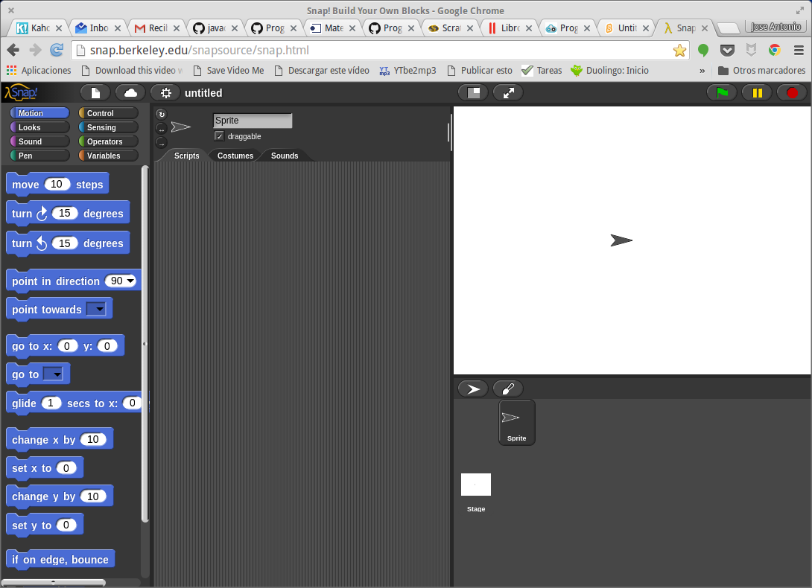

# Scratch y Arduino

## CEP Motril

### José Antonio Vacas @javacasm

## https://github.com/javacasm/ScratchArduinoMotril
* * * 

# [Snap](http://snap.berkeley.edu/)

* Es una alternativa a [Scratch](./Scratch.md)
* Los bloques son prácticamente idénticos
* Usa 100% open source (basado en javascript y HTML)
* Podemos descargar el código y usarlo offline

